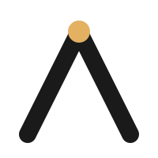

<div align="center">

<picture>
  <source media="(prefers-color-scheme: dark)" srcset=".assets/logo-dark.svg">
  
</picture>

# Project Apex

**Personalized strength training, via persistent behavioral memory.**

[](docs/phase-2-verification-gate-report.md)
[](#how-it-works)
[](docs/phase-2-verification-gate-report.md)
[](#status)

</div>

---

## What this is

An iOS strength coaching app with a server side persistent memory architecture. Every completed workout posts to a Supabase Edge Function that runs seven rule modules in a single transaction and updates a typed per user record in Postgres JSONB. The next prescription reads from that record.

Currently in alpha.

## How it works

```
   iOS client (Swift) ──POST──▶ Edge Function (Deno) ──UPSERT──▶ Postgres JSONB
                                                                       │
              ◀────────────── TraineeModelDigest ─────────────────────┘
                              (narrow projection, token economics)
```

**iOS client** (Swift 6). Logs sessions, prescribes sets at runtime via the Anthropic API, queues writes through a write ahead queue for offline durability.

**Edge Function** (Deno). Idempotency PK insert, watermark check ([ADR-0008](docs/adr/0008-trainee-model-session-ordering.md)), seven rule modules in dependency order, single UPSERT.

**Trainee model** (Postgres JSONB). Per pattern progression, per exercise EWMA strength estimates, two axis recovery state, prescription accuracy stratified by inter session gap, log log transfer regressions between exercise pairs, cross pattern fatigue interactions, classifier derived form degradation and active limitations. Codable shape locked across Swift and TypeScript.

The client reads a narrow `TraineeModelDigest` projection at prescription time, not the full record, to keep prompt tokens bounded.

## Architecture notes

**Persistent structured trainee model** ([ADR-0005](docs/adr/0005-persistent-structured-trainee-model.md)). State is reconstructed once on writes, queried on reads. The AI never rebuilds user state from raw logs per inference.

**Queue event windowed progression** ([ADR-0002](docs/adr/0002-queue-shape-programme-model.md)). Plateau detection, volume deficit, and disruption signals window over recent training events, not calendar time.

**Two stage orchestrator** ([ADR-0013](docs/adr/0013-trainee-model-classifier-stage-failure-isolation.md)). Stage 1 deterministic rules commit in a single transaction. Stage 2 LLM classifier runs after Stage 1 commits. Stage 2 failure does not roll back Stage 1.

**Idempotency at the DB layer** ([ADR-0006](docs/adr/0006-server-side-trainee-model-update-logic.md)). Same `(user_id, session_id)` posted twice returns the cached snapshot. Writes whose `loggedAt < watermark` are refused.

## Where to read more

- [`ARCHITECTURE.md`](ARCHITECTURE.md) — the deep dive
- [`CONTEXT.md`](CONTEXT.md) — domain language and repo conventions
- [`docs/adr/`](docs/adr/) — architectural decision records
- [`docs/phase-2-integration-audit-2026-05-10.md`](docs/phase-2-integration-audit-2026-05-10.md) — Phase 2 cold path audit
- [`docs/phase-2-verification-gate-report.md`](docs/phase-2-verification-gate-report.md) — G1 verdict (PASS-CONDITIONAL)

## Status

| Phase | What | State |
|---|---|---|
| 1 | Legacy Swift services and RAG | shipped |
| 2A | Trainee model rule modules (pure functions) | merged |
| 2 wiring | Orchestrator integration (A14–A23) and G1 gate | landed 2026-05-10 |
| 2B | Legacy → trainee cutover (B1–B4) | gated on alpha cohort training data accrual |
| 3+ | TBD | — |

The CI [Edge Function Tests (Deno)](.github/workflows/ci.yml) job runs the orchestrator and smoke suite against a real local Supabase instance on every PR.

## Stack

Swift 6, Claude API, Voyage AI embeddings, Supabase with pgvector, Postgres JSONB, Deno Edge Functions.

## Author

Built by [Arnav Menon](https://github.com/thearnavmenon).
